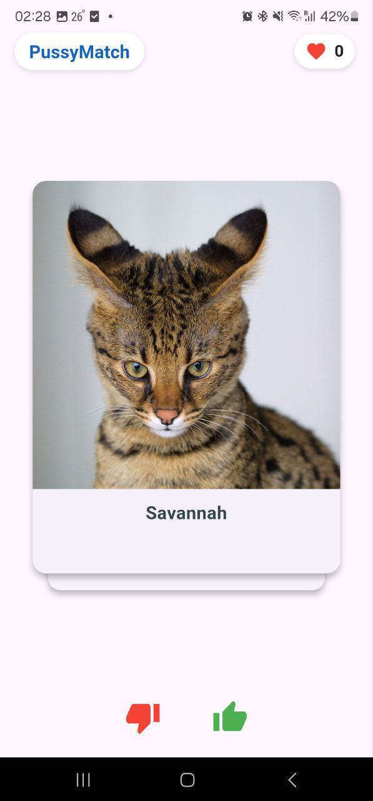
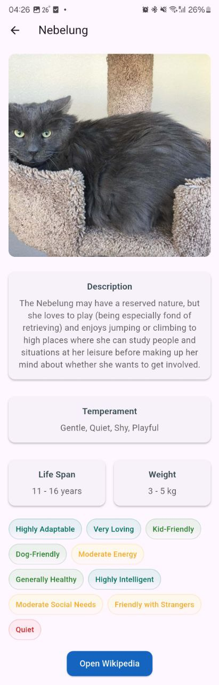
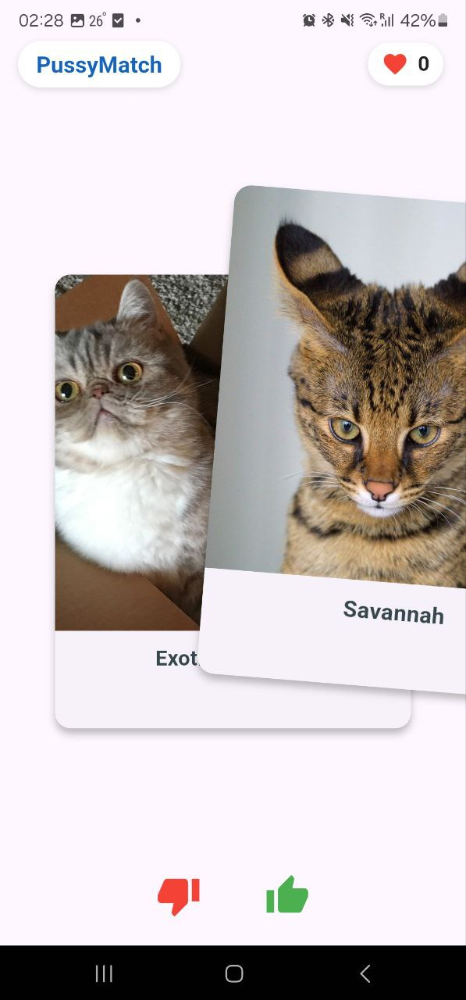
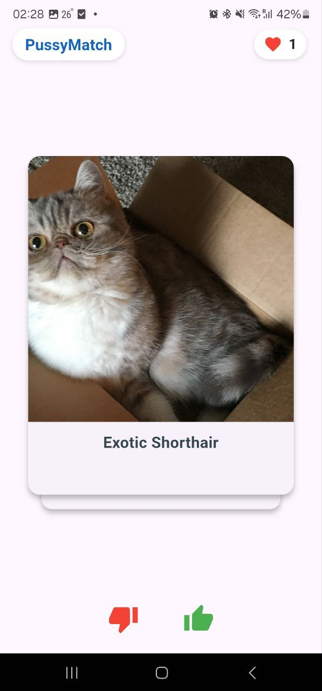
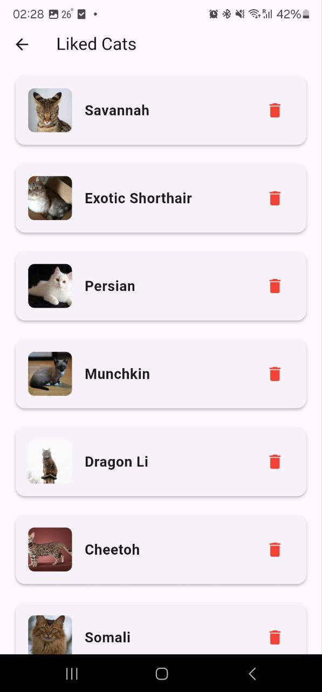

# PussyMatch 🐱

PussyMatch is a Tinder-like application for finding the perfect cat breed for you. Swipe through adorable cat images, learn about their breeds, and save your favorites!

## Features ✨
- Swipe or tap to like/dislike cat images.
- View detailed information about each cat breed.
- Save your favorite cats and view them later.
- Custom app icons for a polished look.

## Screenshots 📸
### Main screen

---
### Details page

<h3>Swipe mechanic demonstration </h3>

- #### Mid swipe

- #### After swipe (the counter has increased)

---

### Liked cat profiles screen

---

### Custom app icon

---

## Download APK 📥
[Download the latest APK here](https://github.com/LysinKirill/PussyMatch/releases/download/v0.6.9/app-release.apk)

## How to Run 🚀
1. Clone the repository.
2. Run `flutter pub get` to install dependencies.
3. Run `flutter run` to start the app.

## Dependencies 📦
- `http`: For making API requests.
- `flutter_card_swiper`: For swipe functionality.
- `flutter_launcher_icons`: For generating app icons.